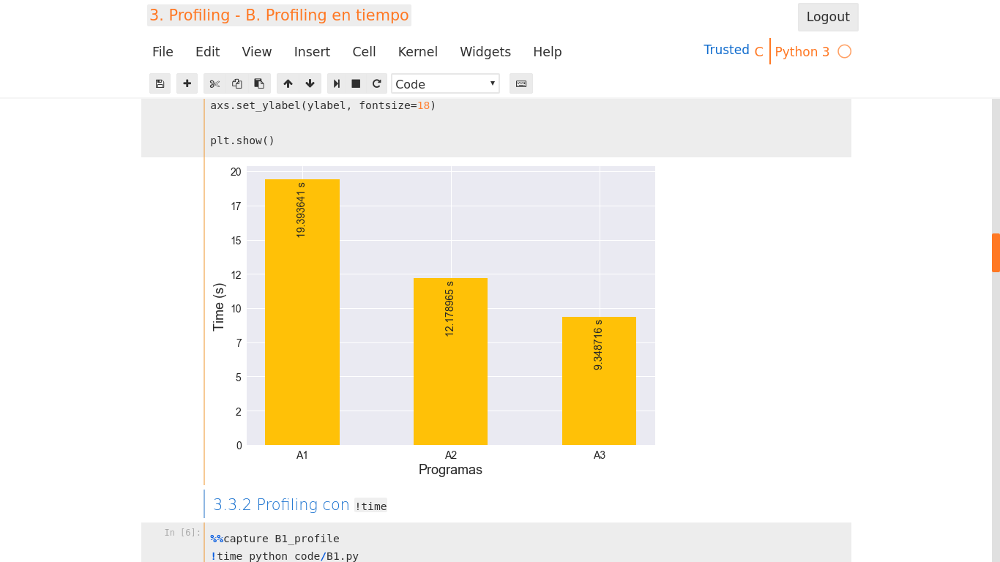

# Introducción a la Computación de alto rendimiento con Python

[][1]
[![BSD-3-Clause][2]][1] [![Python][3]][1] [![HTML5][4]][1] [![MD][5]][1] [![Jupyter Notebook][6]][1] [![HPC][7]][1]

Notebooks de ejemplos que originalmente usé para la charla "Introducción a la Computación de alto rendimiento con Python" en la XXIII INTERCON (2016) en la Universidad de Piura, Lima, Perú.

Posteriormente estos notebooks fueron usados como parte de un curso de Python dictado en la Facultad Ciencias Matemáticas de la Universidad Nacional Mayor De San Marcos.

Según las circunstancias, iré actualizando y extendiendo el material contenido en este repositorio.

## Como usar

1. Clona el repositorio
    ```
    git clone https://github.com/zodiacfireworks/talk--introduction-to-hpc-with-python.git
    ```

2. Ingresa al folder del repositorio, crea un entorno virtual e instala las dependencias (Es recomendable usar conda)
    ```
    cd talk--introduction-to-hpc-with-python
    conda create --name PyHPC --file requirements.conda
    ```

3. Corre el servidor de Jupyter Notebook
    ```
    jupyter notebook
    ```

4. Espera hasta que el navegador se abra, ingresa a la carpeta `notebooks` y disfruta :smile:

## Charlas

* **`[08.2016]`** Introducción a la Computación de alto rendimiento con Python

  Organizado por la Rama Estudiantil IEEE de la Universidad de Piura, Piura - Perú, del 2 al 5 de agosto del 2016.

* **`[12.2016]`** Taller de Programación Python en Linux Fedora

  Organizado por la Rama Estudiantil IEEE CIS de la Escuela Académico Profesional de Computación Científica de la Facultad Ciencias Matemáticas de la Universidad Nacional Mayor De San Marcos, Lima - Perú, del 12 al 16 de diciembre del 2016.

## Autor

* [@zodiacfireworks](https://github.com/zodiacfireworks)

## Licencia

Todos los recursos desarrollados por mí en este repositorio están sujetos la licencia BSD 3 Clause.

Los recursos con sus respectivas licencias están protegidos por ella.

Si usted encuentra contenido protegido por Derechos de autor, por favor contácteme para dar los respectivos créditos y corregir de acuerdo a la ley.

[1]: git@github.com:zodiacfireworks/meteorological-faker.git
[2]: https://img.shields.io/badge/License-BSD%203%20Clause-blue.svg?maxAge=2592000&style=flat-square
[3]: https://img.shields.io/badge/Language-Python-green.svg?maxAge=2592000&style=flat-square
[4]: https://img.shields.io/badge/Language-HTML5-orange.svg?maxAge=2592000&style=flat-square
[5]: https://img.shields.io/badge/Language-Markdown-lightgrey.svg?maxAge=2592000&style=flat-square
[6]: https://img.shields.io/badge/Tool-Jupyter%20Notebook-orange.svg?maxAge=2592000&style=flat-square
[7]: https://img.shields.io/badge/Topic-HPC-blue.svg?maxAge=2592000&style=flat-square
